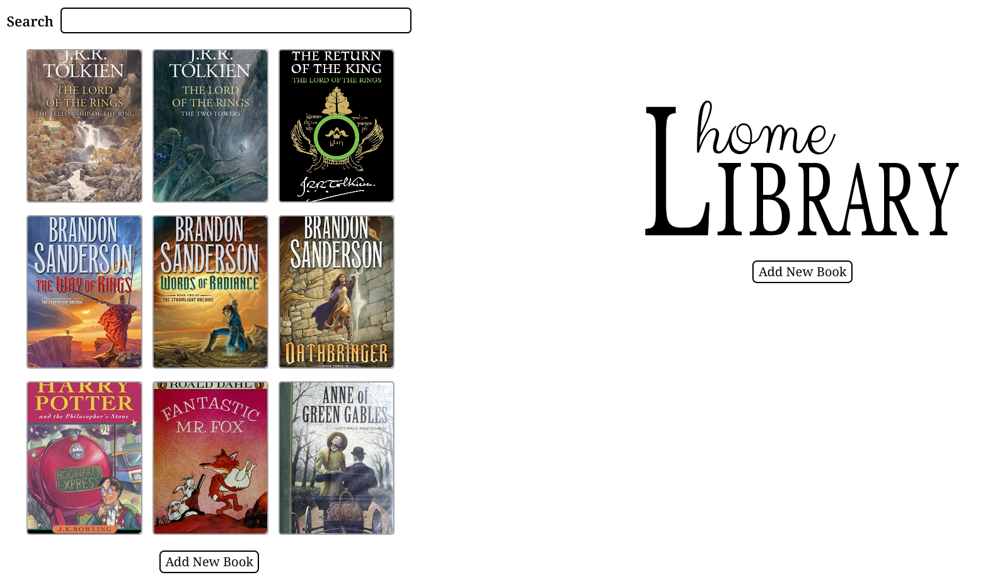

# Home Library Catalog

## Project Description

This app provides a simple way to keep tracks of books you own or have on your wishlist. You can enter books manually or search for them by ISBN. All book data, including cover images, are stored locally in the client's browser.

## Instructions

To run locally, install the node modules with `npm install` and then start the app with `npm run dev`. You'll start with an empty list of books and can start adding your own (some ISBNs are shared below). If you want to see how the app works with some books populated for you, open the [LibraryApp](./src/components/LibraryApp.tsx) component and switch the `devMode` variable from `false` to `true` (note that these books will not have cover images).

### Starter ISBNs

- **Fantastic Mr. Fox:** 9780140328721
- **Anne of Green Gables:** 9781402714511
- **Project Hail Mary:** 9780593135204
- **The Fellowship of the Ring**: 9780008376123
- **The Two Towers**: 9780008376130
- **The Return of the King**: 9780008376147
- **The Way of Kings**: 9780765326355
- **Words of Radiance**: 9780765326362
- **Oathbringer**: 9780765326379
- **Harry Potter and the Philosopher's Stone**: 9780747532699

## API Information

This project uses the [OpenLibrary API](https://openlibrary.org/developers/api) from [Internet Archive](https://archive.org/). The API is used to search by ISBN for book titles, authors, publish dates, and cover images. The incoming data is handled through the [Zod](https://zod.dev/) library and some additional code to process the data and convert it into my expected `book` type.

This project also integrates with the `localStorage` and `indexedDB` Web APIs for persistent and offline storage. The files within this projects' [/storage](./src/storage/) folder contain all the logic for CRUD operations with these APIs.

## Additional Features

This project uses:

- custom hooks
- persistent data
- the Zod third-party library

## Going Forward

If I continue developing this project, my next steps would be:

- integrate a barcode scanner to find books rather than typing out ISBN numbers.
- break the monstrous [EditBookDetail](./src/components/EditBookDetail/EditBookDetail.tsx) component into more files with specific purposes.
- improve the search functionality to search by author, ISBN, and more.
